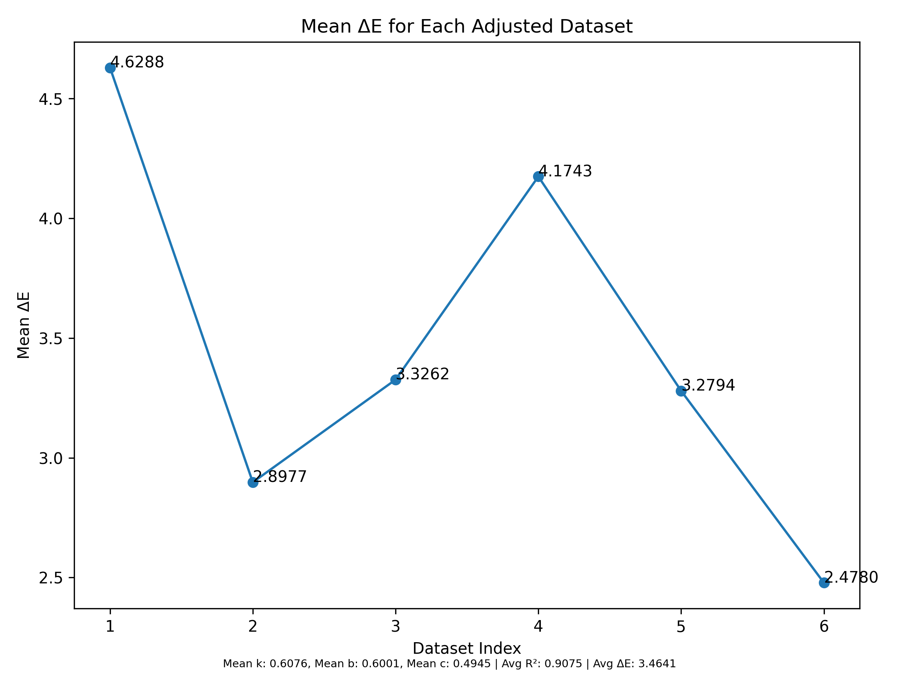
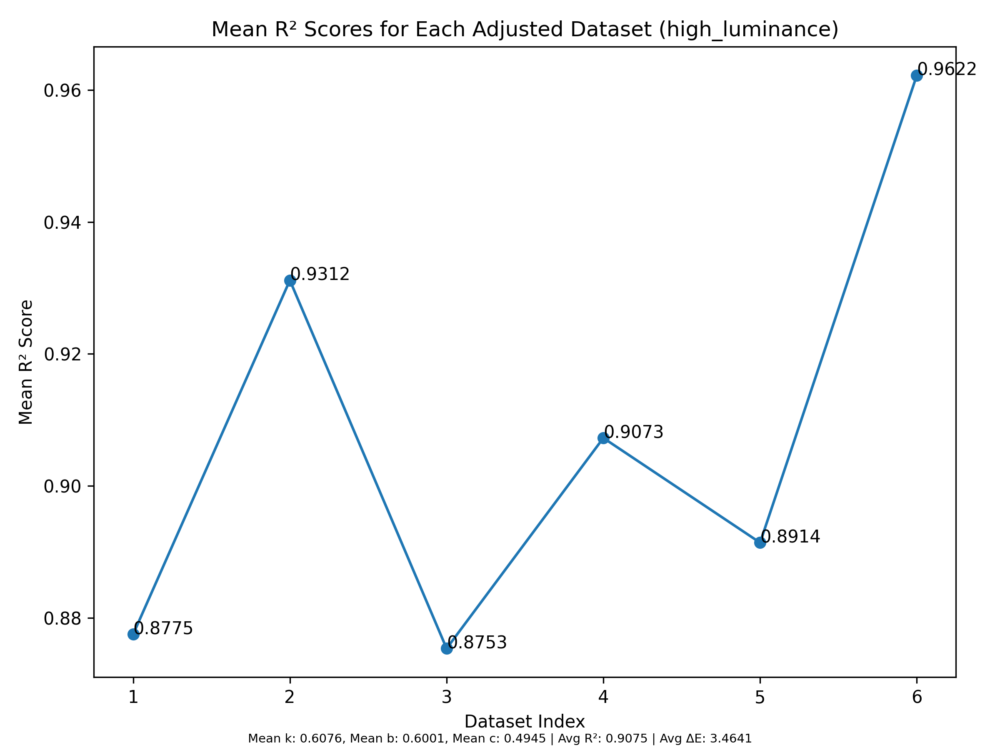
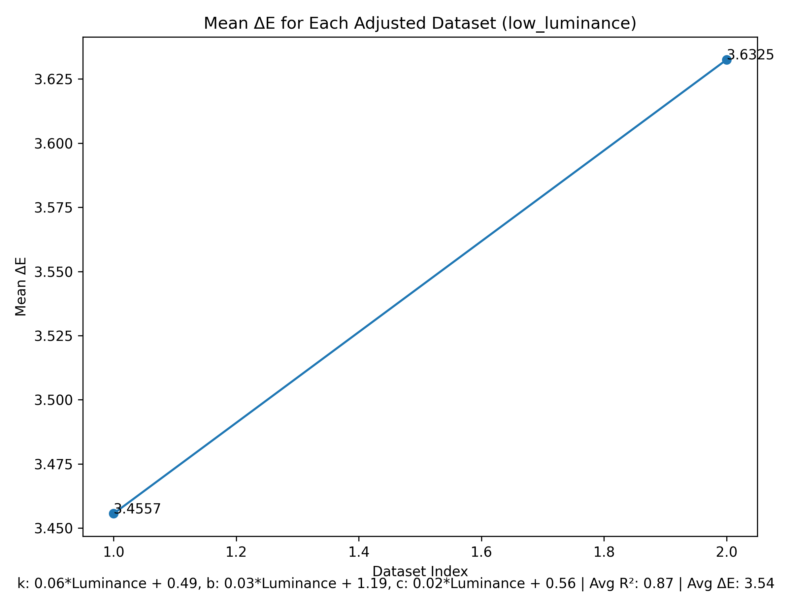

# Parameter Fitting Results

## Initial Guesses
- k: 1
- b: 1
- c: 0.5

## Bounds
- Lower bounds: [-10, -10, 0.1]
- Upper bounds: [10, 10, 5]

---

## High Values

| k                          | b                          | c                          | Average R²             |
|----------------------------|----------------------------|----------------------------|------------------------|
| 0.38677932109186197        | 0.6057069491726627         | 0.514108759040828          | 0.9549634505687253     |
| 0.9605962996213758         | 0.5512741535277434         | 0.4922457726706687         | 0.9923119055451716     |
| 0.9610641039510831         | 0.5197937857833922         | 0.5014132916631974         | 0.9980114017651068     |
| 0.4678580858625875         | 0.6470778100882398         | 0.5221759100631896         | 0.9935782837530036     |
| 0.6067140367758307         | 0.6489560991778178         | 0.49217122088478743        | 0.9421636883579769     |
| 0.6545874615111709         | 0.7210161271173162         | 0.49416295186617665        | 0.8745204392081426     |
| 0.8059911470842765         | 0.7301108238017577         | 0.49909061742359623        | 0.998478813196208      |

### Generalized Model YUsing Mean Values: 
- k: 0.65
- b: 0.63
- c: 0.50
- Average $R^2$: 0.89
- Average $\Delta E$: 3.65

### Performance Visualization

---

## Low Values

| k                          | b                          | c                          | Average R²             |
|----------------------------|----------------------------|----------------------------|------------------------|
| 2.0357034787433212         | 2.0607898085289307         | 0.9483097745557906         | 0.9591301095404321     |
| 3.5176230917102296         | 2.899914879810237          | 1.3252179508149227         | 0.9192867107469842     |

### Performance of generalized model using Linear fit

